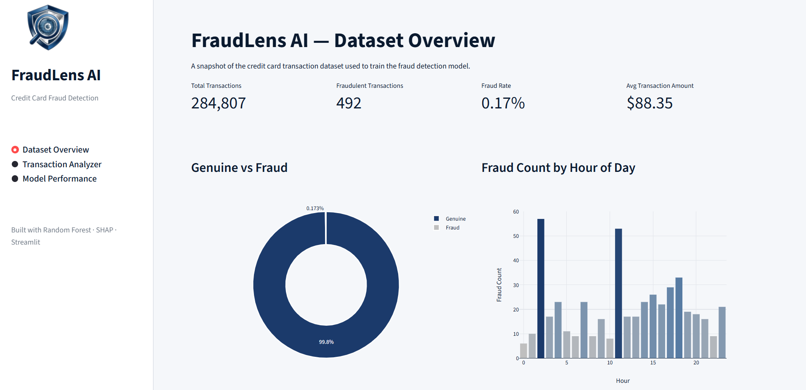
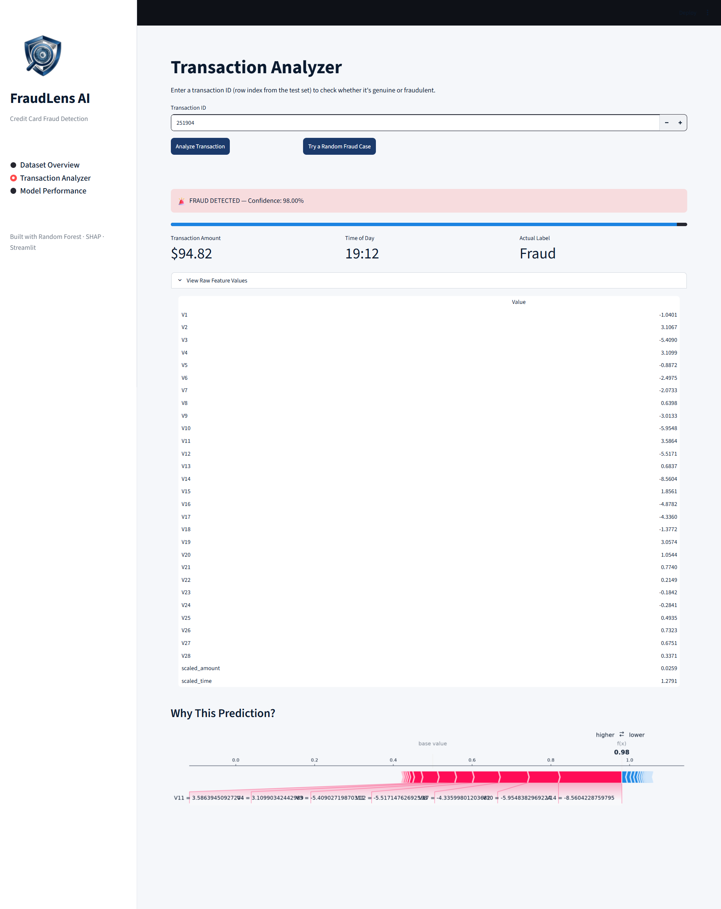
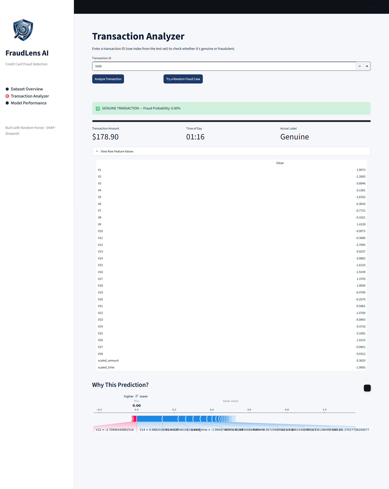
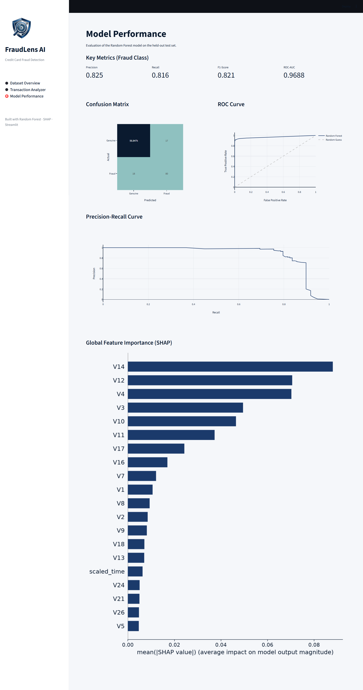

# 🛡️ FraudLens AI — Credit Card Fraud Detection

A complete end-to-end machine learning project for detecting fraudulent credit card transactions. This project covers the full pipeline — exploratory data analysis, preprocessing, model training and comparison, evaluation, SHAP explainability, and a deployed Streamlit web application.

---

## 🚀 Live Demo

Try FraudLens AI here:

🔗 [FraudLens AI — Live App](https://fraudlens-ai-randomforest.streamlit.app/)

### App Screenshots

**Dataset Overview**


**Transaction Analyzer — Fraud Detected**


**Transaction Analyzer — Genuine**


**Model Performance**

---

## 📌 Problem Statement

Credit card fraud detection is a classic imbalanced classification problem:

- Fraud accounts for only **0.17%** of all transactions — extreme class imbalance
- A model predicting everything as genuine would score **99.83% accuracy** while catching zero fraud
- Standard accuracy is misleading here — **Precision, Recall, F1-Score, and PR-AUC** are the metrics that actually matter

---

## 📊 Dataset

| Property | Value |
|---|---|
| Source | [Kaggle — Credit Card Fraud Detection (mlg-ulb)](https://www.kaggle.com/datasets/mlg-ulb/creditcardfraud) |
| Total Transactions | 284,807 |
| Fraudulent Transactions | 492 (0.173%) |
| Genuine Transactions | 284,315 (99.827%) |
| Features | 31 (`Time`, `V1`–`V28`, `Amount`, `Class`) |
| Time Period | 2 days of European cardholder transactions |

**Feature notes:**
- `V1`–`V28` — PCA-transformed components (original features anonymized for privacy)
- `Time` — seconds elapsed since the first transaction
- `Amount` — transaction amount
- `Class` — target (0 = Genuine, 1 = Fraud)

---

## 📂 Project Structure

```
FraudLens-AI/
│
├── app.py
│
├── data/
│   ├── creditcard_sample.csv
│   ├── original_test_evaluation.csv.gz
│   └── dataset_stats.json
│
├── models/
│   ├── model.pkl
│   ├── amount_scaler.pkl
│   └── time_scaler.pkl
│
├── notebooks/
│   ├── 01_eda_preprocessing.ipynb
│   ├── 02_modeling.ipynb
│   ├── 03_evaluation.ipynb
│   └── 04_shap.ipynb
│
├── requirements.txt
└── README.md
```

> **Note:** `data/creditcard.csv` isn't included in this repo (150MB+, exceeds GitHub's limits). Download it from Kaggle and place it in a `data/` folder to run the notebooks or app locally.

---

## 💻 Streamlit App — FraudLens AI

Three sections:

**Dataset Overview**
- Key stats: total transactions, fraud count, fraud rate, average amount
- Genuine vs Fraud distribution
- Fraud count by hour of day

**Transaction Analyzer**
- Enter any transaction ID (row index from the test set)
- Get an instant fraud/genuine prediction with a confidence score
- View the transaction's raw feature values
- See a live SHAP explanation of *why* the model made that specific decision

**Model Performance**
- Precision, Recall, F1-Score, and ROC-AUC for the final model
- Confusion matrix, ROC curve, and Precision-Recall curve
- Global SHAP feature importance

### Running the App Locally

```bash
git clone https://github.com/khushichandak27/FraudLens-AI.git
cd FraudLens-AI
pip install -r requirements.txt

# Download creditcard.csv from Kaggle and place it in a data/ folder
# https://www.kaggle.com/datasets/mlg-ulb/creditcardfraud

streamlit run app.py
```

---

## 🧠 Methodology

### 1. Exploratory Data Analysis & Preprocessing

**Class Imbalance**
- Only 492 fraud transactions out of 284,807 (0.173%)
- A model predicting "always genuine" would score 99.83% accuracy but catch zero fraud

**Amount & Time Patterns**
- Fraudulent transactions skew toward lower amounts with a tighter spread than genuine ones
- Genuine transactions show a clear dip during nighttime hours; fraud stays comparatively active through those low-activity hours — a pattern worth flagging on its own

**Correlation with Fraud**
- Strongest negative correlation: `V17`, `V14`, `V12`, `V10`, `V16`, `V3`, `V7`
- Positive correlation: `V11`, `V4`, `V2`
- No single feature is a strong standalone predictor — the model combines all of them

**Preprocessing**
- `Amount` and `Time` scaled with separate `StandardScaler` instances (saved for reuse in the app); `V1`–`V28` left untouched (already PCA-scaled)
- Stratified train/test split to preserve the fraud ratio in both sets
- **SMOTE** applied only to the training set (never the test set, to avoid data leakage)

| | Genuine | Fraud |
|---|---|---|
| Before SMOTE (train) | 227,451 | 394 |
| After SMOTE (train) | 227,451 | 227,451 |

---

### 2. Model Training & Comparison

Three models trained on SMOTE-balanced data, evaluated on the original imbalanced test set:

| Model | Precision | Recall | F1-Score | ROC-AUC |
|---|---|---|---|---|
| Logistic Regression | 0.06 | 0.92 | 0.11 | 0.9698 |
| **Random Forest** | **0.82** | **0.82** | **0.82** | 0.9688 |
| XGBoost | 0.68 | 0.86 | 0.76 | **0.9745** |

**Random Forest selected as the final model** — best balance of precision and recall, meaning fewer false alarms without sacrificing fraud detection.

---

### 3. Evaluation

**Confusion Matrix (Random Forest):**

| | Predicted Genuine | Predicted Fraud |
|---|---|---|
| **Actual Genuine** | 56,847 | 17 |
| **Actual Fraud** | 18 | 80 |

| Metric | Score |
|---|---|
| Precision | 0.825 |
| Recall | 0.816 |
| F1-Score | 0.821 |
| ROC-AUC | 0.9688 |
| Average Precision (PR-AUC) | 0.8678 |

The Precision-Recall curve stays close to 1.0 up to roughly 70% recall, then drops sharply past ~85% recall — showing the model's natural operating limit before false alarms start outweighing additional fraud caught.

---

### 4. SHAP Explainability

Rather than treating the model as a black box, this project uses **SHAP** to explain predictions both globally and per-transaction.

**Global feature importance:** `V14`, `V12`, `V4`, `V3`, `V10`, `V11`, `V17` are consistently the most influential features — matching the correlation analysis from the EDA stage almost feature-for-feature.

**Local explanation:** for individual transactions, SHAP shows exactly which features pushed a prediction toward fraud or genuine — this is surfaced live in the Streamlit app's Transaction Analyzer.

---

## 🔑 Key Learnings

1. **Class imbalance is the core challenge** — SMOTE must be applied to training data only, never the test set
2. **Accuracy is meaningless here** — Precision, Recall, F1, and PR-AUC tell the real story
3. **Model selection is a tradeoff, not a single "best" answer** — Random Forest balances precision/recall; XGBoost trades precision for slightly higher recall and ROC-AUC
4. **SHAP turns a black-box model into an explainable one** — critical for a domain like fraud detection where decisions need to be justifiable
5. **PCA-anonymized features limit feature engineering** — but also guarantee no multicollinearity between inputs

---

## 🛠️ Tech Stack

- **Language:** Python
- **Data & ML:** pandas, NumPy, scikit-learn, imbalanced-learn, XGBoost
- **Explainability:** SHAP
- **Visualization:** Matplotlib, Seaborn, Plotly
- **Web App:** Streamlit

---

## 🚀 Future Improvements

- [ ] Threshold tuning for cost-sensitive fraud/false-alarm tradeoffs
- [ ] Hyperparameter tuning (e.g., Optuna) to push PR-AUC further
- [ ] Compare against an unsupervised approach (Isolation Forest / Autoencoder)
- [ ] Document a model card with limitations and intended use

---

## 👤 Author

**Khushi Chandak**
[GitHub](https://github.com/khushichandak27)
